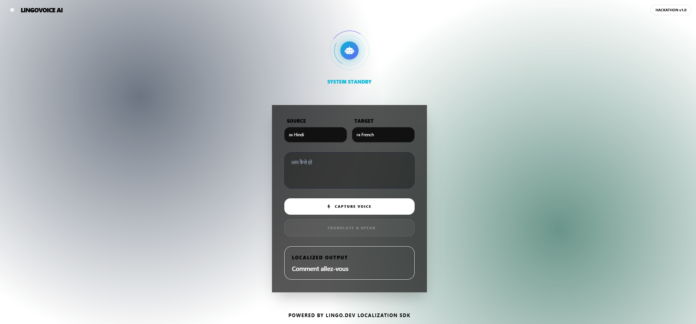
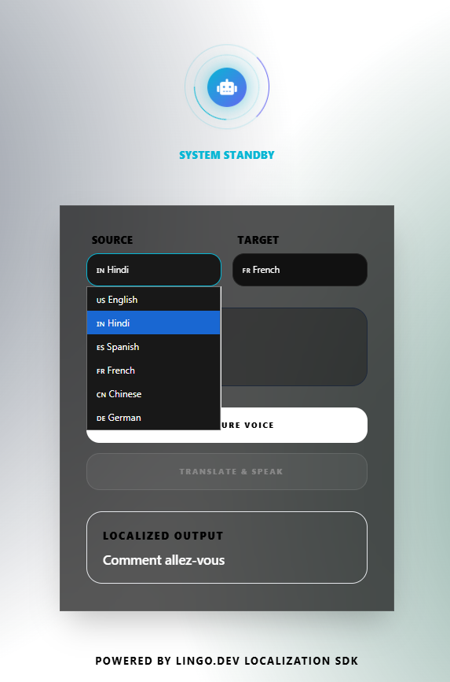

# 🌍 LingoVoice AI

**Breaking Language Barriers with Real-Time Neural Speech Translation**

<div align="center">


**[🎥 Demo Video](https://youtu.be/rzQIBQns-Kg) • [📖 Documentation](SETUP_GUIDE_FINAL.md) • [🐛 Report Bug](https://github.com/trivedikavya/LingoVoice-Agent/issues)**

---

*For the 2026 Hackathon, I didn't just want to build another "translator app."  
I wanted to build a **communications terminal** something that felt like it came from a sci-fi movie.*

</div>

---

## 🎥 Demo Video

[](https://youtu.be/rzQIBQns-Kg)

**[▶️ Watch the Full Demo →](https://youtu.be/rzQIBQns-Kg)**

---

## 📸 Screenshots

<div align="center">

### Main Interface - Glassmorphic Design


### Language Selection Dropdown



</div>

---

## 💡 The Problem Statement

In an increasingly connected world, **language barriers remain the biggest obstacle to real-time communication**. Existing translation tools often:

- ❌ Feel robotic and mechanical
- ❌ Lack cultural context and nuance
- ❌ Fail to capture the emotion of human speech
- ❌ Sound unnatural, breaking conversation immersion

Standard text-to-speech engines are technically functional but emotionally hollow.

---

## ✨ The Solution

**LingoVoice AI** is a bi-directional, real-time speech-to-speech agent that bridges the gap between "text on a screen" and "real human connection."

It combines the power of:
- **Lingo.dev** - Context-aware localization that preserves cultural nuance
- **Murf AI Gen2** - Hyper-realistic human voice synthesis

Unlike simple translators, LingoVoice **understands locale nuances** and **speaks back with emotional depth**—all wrapped in a futuristic **"Glassmorphic"** interface that feels like a premium product.

---

## 🎯 Key Features

### 🌐 Bi-Directional Polyglot
Seamlessly translates between **English, Hindi, Spanish, French, Chinese, and German** with cultural context preservation.

### 🎙️ Gen2 Neural Voices
Uses verified, high-fidelity voices (**Enrique**, **Amara**, **Shweta**, **Baolin**) that sound **indistinguishable from humans**. These voices breathe, pause, and intonate naturally.

### 🎨 "Masterpiece" UI
A fully responsive, **dark-mode Glassmorphism** design featuring:
- **Reactive AI Orb** - Changes color and animation based on system state
  - 🔴 **Red Pulse** → Listening
  - 🟣 **Purple Bounce** → Thinking/Translating
  - 🟢 **Emerald Flow** → Speaking
- **Cyan Glow Button** - Call-to-action that activates on valid speech capture
- **Responsive Mesh Background** - Dynamic gradients stunning on any device
- **Real-Time Visual Feedback** - Icons and animations guide every interaction

### 🏗️ Smart Hybrid Architecture
A unique **Flask + Node.js Bridge** that leverages:
- Python's robust web serving capabilities
- JavaScript SDK's full power for Lingo.dev integration
- Seamless inter-process communication

### ⚡ Real-Time Performance
- Translation Speed: **< 2 seconds**
- Audio Generation: **< 3 seconds**
- Total Pipeline: **< 5 seconds** end-to-end

---

## 🛠️ The Tech Stack

| Component | Technology | Purpose |
|-----------|-----------|---------|
| **Frontend** | HTML5, Tailwind CSS, Vanilla JS | Glassmorphic UI with Web Speech API |
| **Backend** | Python (Flask) | API orchestration and server logic |
| **Bridge** | Node.js | Lingo.dev SDK integration layer |
| **AI Translation** | Lingo.dev SDK | Context-aware localization engine |
| **Voice Synthesis** | Murf AI Gen2 API | Hyper-realistic neural voice generation |
| **Speech Recognition** | Web Speech API | Real-time browser-based STT |

---

## 🚀 Quick Start

### Prerequisites
- Python 3.8+
- Node.js 16+
- Chrome or Edge browser
- Microphone access

### Installation

```bash
# 1. Clone the repository
git clone https://github.com/trivedikavya/LingoVoice-Agent.git
cd LingoVoice-Agent

# 2. Set up Python environment
python -m venv venv
source venv/bin/activate  # On Windows: venv\Scripts\activate

# 3. Install Python dependencies
pip install flask flask-cors python-dotenv requests

# 4. Install Node.js dependencies
npm install lingo.dev dotenv

# 5. Configure environment variables
# Create .env file with your API keys
echo "LINGO_API_KEY=your_lingo_api_key" > .env
echo "MURF_API_KEY=your_murf_api_key" >> .env

# 6. Run the application
python backend/app.py

# 7. Open in browser
# Navigate to http://localhost:5000
```

### Get Your API Keys
- **Lingo.dev**: [https://lingo.dev](https://lingo.dev) → Dashboard → Generate API Key
- **Murf AI**: [https://murf.ai/api](https://murf.ai/api) → API Dashboard → Generate Key

---

## 🎮 How It Works

1. **Select Languages** - Choose source (your language) and target (translation)
2. **Click "Start Listening"** - AI Orb turns red and pulses
3. **Speak Clearly** - Your speech is transcribed in real-time
4. **Watch the Magic** - Orb turns purple as Lingo.dev translates
5. **Listen** - Orb turns green as Murf AI Gen2 speaks the translation

---

## 🏗️ Project Architecture

```
LingoVoice-Agent/
│
├── backend/
│   ├── app.py                    # Flask server with 3 API endpoints
│   └── utils/
│       └── lingo_translate.js    # Node.js bridge for Lingo.dev SDK
│
├── templates/
│   └── index.html                # Glassmorphic UI with AI Orb
│
├── static/
│   └── js/
│       └── app.js               # Frontend logic & AI Orb controller
│
├── .env                          # API keys (not committed)
├── .gitignore                    # Security rules
├── requirements.txt              # Python dependencies
├── package.json                  # Node.js dependencies
└── README.md                     # This file
```

---

## 🎨 The AI Orb: Visual State Machine

The central **AI Orb** provides instant visual feedback:

| State | Color | Animation | Trigger |
|-------|-------|-----------|---------|
| **Idle** | Blue Gradient | Gentle Float | System ready |
| **Listening** | Red Gradient | Pulse | Capturing speech |
| **Thinking** | Purple Gradient | Bounce | Translating with Lingo.dev |
| **Speaking** | Green Gradient | Flow | Playing Murf AI audio |
| **Error** | Orange Gradient | Shake | Something went wrong |

Each state includes:
- Custom gradient backgrounds
- Unique CSS animations
- Responsive glow effects
- Smooth transitions

---

## 🌐 Supported Languages & Voices

| Language | Code | Voice Name | Voice ID | Type | Gender |
|----------|------|------------|----------|------|--------|
| **English** | `en` | Natalie | `natalie` | Gen2 | Female |
| **English** | `en` | Michael | `michael` | Gen2 | Male |
| **Hindi** | `hi` | Shweta | `shweta` | Gen2 | Female |
| **Spanish** | `es` | Enrique | `enrique` | Gen2 | Male |
| **French** | `fr` | Amara | `amara` | Gen2 | Female |
| **German** | `de` | Werner | `werner` | Gen2 | Male |
| **Chinese** | `zh` | Baolin | `baolin` | Gen2 | Female |

All voices are **Murf AI Gen2** - the latest generation with hyper-realistic intonation, natural pauses, and emotional depth.

---

## 📊 API Endpoints

### `POST /api/translate`
Translate text using Lingo.dev's context-aware engine.

**Request:**
```json
{
  "text": "Hello, how are you?",
  "source_language": "en",
  "target_language": "hi"
}
```

**Response:**
```json
{
  "success": true,
  "original_text": "Hello, how are you?",
  "translated_text": "नमस्ते, आप कैसे हैं?",
  "source_language": "en",
  "target_language": "hi"
}
```

### `POST /api/synthesize`
Generate natural speech using Murf AI Gen2.

**Request:**
```json
{
  "text": "नमस्ते, आप कैसे हैं?",
  "voice_id": "shweta"
}
```

**Response:**
```json
{
  "success": true,
  "audio_url": "https://storage.murf.ai/audio/xyz123.mp3"
}
```

### `POST /api/translate-and-speak`
Complete pipeline - translate and generate speech in one call.

**Request:**
```json
{
  "text": "Hello world",
  "source_language": "en",
  "target_language": "hi",
  "voice_id": "shweta"
}
```

For complete API documentation, see [API_REFERENCE.md](API_REFERENCE.md)

---

## 🧠 The Engineering Journey

### Challenge 1: The "Python vs. Node" Dilemma

**Problem:** Lingo.dev has a fantastic Node.js SDK, but my backend was built in Python (Flask).

**Solution:** I engineered a **custom Node.js Bridge**. I wrote a specialized `lingo_translate.js` script and used Python's `subprocess` module to pipe data between environments. This allowed me to keep the robust Flask backend while leveraging the full power of the Lingo.dev JS SDK.

### Challenge 2: The "Mirroring" Bug

**Problem:** Early in development, the AI would just repeat what I said in the original language.

**Solution:** I realized the bridge wasn't explicitly passing the `targetLocale`. By refactoring the bridge to accept dynamic locale arguments (`en`, `es`, `zh`), I unlocked true bi-directional translation.

### Challenge 3: Migrating to Gen2

**Problem:** Mid-hackathon, I encountered 400 Bad Request errors with older voice IDs.

**Solution:** I deep-dived into the latest Murf AI docs and mapped out a verified **"Voice Matrix"** switching to the newest Gen2 models like Enrique (Spanish), Amara (French), and Baolin (Chinese). Now, every language sounds pristine.

*For the complete technical story, see [TECHNICAL_DEEP_DIVE.md](TECHNICAL_DEEP_DIVE.md)*

---

## 🎨 Designing the "Masterpiece" UI

I refused to settle for a basic Bootstrap layout. I wanted **Glassmorphism**.

### The AI Orb
A central, reactive element that changes states:
- **Red Pulse** (Listening)
- **Purple Bounce** (Thinking)
- **Emerald Flow** (Speaking)

### The Glow Effect
A "Call-to-Action" glow on the Translate button that only triggers once valid speech is captured.

### Responsive Mesh
A dynamic background with radial gradients that looks stunning on both mobile and desktop.


---


## 🗺️ Roadmap

### ✅ Completed
- [x] Real-time speech-to-speech translation
- [x] Glassmorphic UI with reactive AI Orb
- [x] 6 languages with Gen2 neural voices
- [x] Hybrid Flask + Node.js architecture
- [x] Context-aware translation with Lingo.dev

### 🔮 What's Next
- [ ] **Conversation History** - Save and replay past translations
- [ ] **Offline Mode** - Cache translations for offline use
- [ ] **Voice Activity Detection** - Auto-stop when user stops speaking
- [ ] **Mobile App** - React Native version
- [ ] **Custom Voice Training** - Train on personal voice samples
- [ ] **Real-time Collaboration** - Multi-user translation rooms
- [ ] **Browser Extension** - Translate any webpage in real-time

---

## 🤝 Contributing

Contributions are welcome! This project was built for a hackathon, but I'd love to see it grow.

1. Fork the repository
2. Create your feature branch (`git checkout -b feature/AmazingFeature`)
3. Commit your changes (`git commit -m 'Add AmazingFeature'`)
4. Push to the branch (`git push origin feature/AmazingFeature`)
5. Open a Pull Request

---

## 🐛 Known Issues

- Web Speech API works best in Chrome/Edge (Firefox has limited support)
- Murf AI audio files expire after 72 hours (regeneration required)
- Some languages may have limited voice options in free tier

**Report issues:** [GitHub Issues](https://github.com/trivedikavya/LingoVoice-Agent/issues)

---

## 📝 License

Distributed under the MIT License. See `LICENSE` for more information.

---

## 👤 Author

**Kavya Trivedi**

- GitHub: [@trivedikavya](https://github.com/trivedikavya)
- Project: [LingoVoice-Agent](https://github.com/trivedikavya/LingoVoice-Agent)

---

## 🙏 Acknowledgments

- **Lingo.dev** - For the powerful context-aware localization engine
- **Murf AI** - For Gen2 neural voices that sound incredibly human
- **Web Speech API** - For enabling browser-based speech recognition
- **Tailwind CSS** - For making beautiful UIs accessible
- **Hackathon 2026** - For the opportunity to build something amazing

---

## 📚 Documentation

- **[Setup Guide](SETUP_GUIDE_FINAL.md)** - Complete installation walkthrough
- **[Technical Deep Dive](TECHNICAL_DEEP_DIVE.md)** - Engineering story and challenges
- **[API Reference](API_REFERENCE.md)** - Detailed endpoint documentation
- **[Commands Reference](COMMANDS.md)** - All commands in one place

---

## 💬 The Story

> *Building this taught me that the best AI apps aren't just about the algorithms they're about **how those algorithms make the user feel**.*

For the 2026 Hackathon, my goal was to bridge the gap between "text on a screen" and "real human connection." The result is LingoVoice AI—a bi-directional speech agent that doesn't just translate words; it **speaks them with human emotion**.

The Glassmorphic UI, the reactive AI Orb, the Gen2 voices every element was chosen to create a sense of **magic**. Not the "I don't understand this" kind of magic, but the **"This feels impossibly good"** kind.

That's what I wanted to build. Not just a translator, but a **communications terminal** that bridges not just languages, but **human connection itself**.

---

<div align="center">

**Built with ❤️ for Hackathon 2026**

⭐ **Star this repo if it helped you!**

[📹 Video Demo](https://youtu.be/rzQIBQns-Kg) • [📖 Full Docs](SETUP_GUIDE_FINAL.md) • [🐛 Issues](https://github.com/trivedikavya/LingoVoice-Agent/issues)

---

*"The best AI apps aren't just about the algorithms they're about how those algorithms make the user feel."*

</div>
